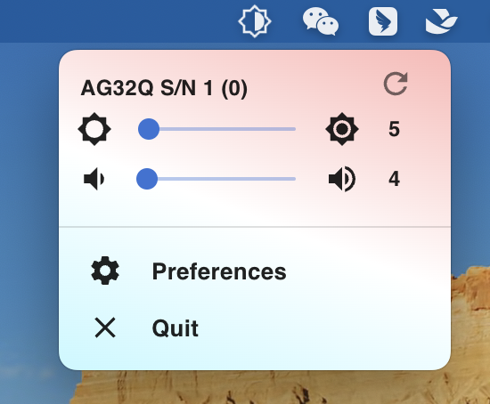
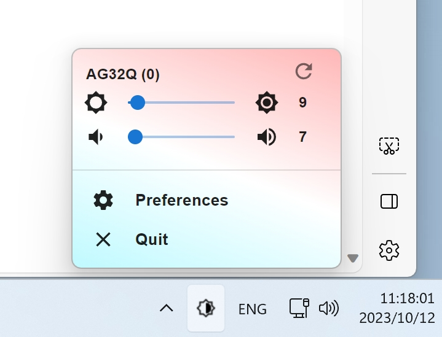

## Monitors App

Currently, most monitors support [ddc/ci](https://en.wikipedia.org/wiki/Display_Data_Channel) control, This tool is used to control the brightness and sound volume of the
monitors. Its should work in multiple platform, like Mac intel (include hackintosh), Mac arm, windows, linux, etc ...

Its uses [ddc/ci](https://en.wikipedia.org/wiki/Display_Data_Channel) to query and update the corresponding data of the monitor. Both the front end and the back end are
developed using electron.




## Platform support

| Platform  | result   |
|-----------|----------|
| Mac Intel | Worked   |
| Windows   | Worked   |
| Mac arm   | Not Test |

- for Windows， you need set MontorsApp tray icon keep in taskbar

## keyboard Shortcut

when app running, you can use global keyboard shortcut to control values. default values are in below, but you can
update these in preferences

```javascript
export const DefaultKBAcceleratorMac = {
  LuminanceUp: 'Command+Option+Right',
  LuminanceDown: 'Command+Option+Left',
  SpeakerVolumeUp: 'Command+Option+Up',
  SpeakerVolumeDown: 'Command+Option+Down',
};

export const DefaultKBAcceleratorWin = {
  LuminanceUp: 'Ctrl+Alt+Right',
  LuminanceDown: 'Ctrl+Alt+Left',
  SpeakerVolumeUp: 'Ctrl+Alt+Up',
  SpeakerVolumeDown: 'Ctrl+Alt+Down',
};
```

## steps for build and package

```bash
npm install
npm run package
```
